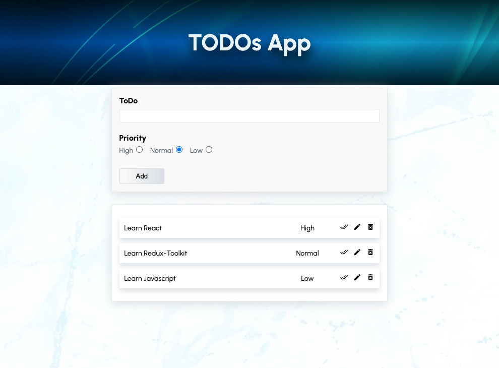

# TODOs Application



### [Live Site](https://todos-app-hsnakk.netlify.app/)

## Introduction

This is a code repository for TODOs Application.

This application was created with

<a href="#" ></a>
<a href="#" ></a>
<a href="#" ></a>


Setup:
- run ```npm i && npm start```  to start the application.